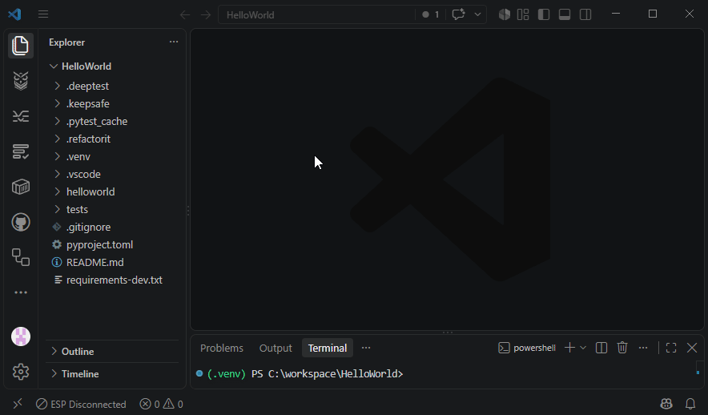
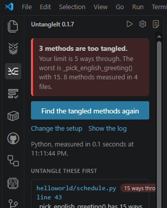

# UntangleIt

"An assistant that says 'done' is not evidence. The numbers are."



UntangleIt untangles one method at a time. It counts the ways through every method in your project, lists the ones too tangled to trust, and hands your AI assistant a strict brief to break each one into smaller pieces without changing what it does. Then it runs your own tests and measures every piece. You decide at every step. UntangleIt never edits code itself, never restores anything, and never accepts the assistant's result on your behalf.

### Why UntangleIt

- **Measured, not claimed**: After the assistant says done, UntangleIt runs your tests and measures every piece against your limit. "Untangled" is a number, not a feeling.
- **Plain words first**: "14 methods are too tangled. The worst is visit() with 23 ways through." The engineer's numbers sit behind one switch.
- **A brief a contractor would recognise**: Behaviour unchanged, existing tests untouched, every piece within the limit, run the whole suite before saying done. It even says "5 or less does not mean reduce by 5", because an assistant once did exactly that.
- **You decide, always**: Nothing is sent before "Yes, send it". After each round you choose Send another round or Stop here.
- **Your own runner**: pytest, Jest, or Vitest, the one your project already has. UntangleIt ships no runtime.
- **100% local**: Every untangling is recorded in `.untangleit/runs.json` in your workspace, meant to be committed with the code. No model, no key, no network.

### UntangleIt + KeepSafe + DeepTest: Partners in Protection

"DeepTest finds it. KeepSafe remembers it. UntangleIt untangles it."

When DeepTest flags a function with too many ways through it, "Break it into smaller pieces" hands the job to UntangleIt. Before the brief goes out, UntangleIt offers a KeepSafe checkpoint; that is the undo. If the untangling breaks tests or leaves pieces over the limit, the report says so and the checkpoint is your way back.

### Workflow

**Find → Checkpoint → Untangle → Measure again → Keep or restore**

### Quick Start

1. Install UntangleIt from the VS Code Marketplace.
2. Open the UntangleIt panel and select Find the tangled methods. The setup screen opens once, already filled in; select Save and find the tangled methods.
3. On the worst method, select Untangle this method. Take the checkpoint when offered, read the dialog, select Yes, send it. The brief goes to the editor's chat and to your clipboard.
4. When the assistant says done, select Measure the method again. Keep the result, send another round, or restore the checkpoint.



---

## Features

**The list, worst first**: Every method over your limit, with a plain sentence saying what its number means. One method per card, the worst at the top.

**Untangle this method**: The one place UntangleIt hands work to an AI, so it asks first. A KeepSafe checkpoint is offered, then one dialog that names the method and says what will happen. The brief states the target three ways, quotes the method, and holds the assistant to rules: behaviour unchanged, existing tests untouched, every piece within the limit, whole suite green before saying done.

**Measure the method again**: Runs your tests through your own runner and measures every piece. The answer is one of three sentences: untangled into N pieces, every one within your limit; not done, these pieces are still over; or the untangling broke tests.

**Rounds**: If it is not done, choose Send another round or Stop here, up to the number of rounds you set (default 3). Then UntangleIt stops and hands the result back to you.

**A record you can commit**: What was sent, when, by whose decision, and what came back, in `.untangleit/runs.json` beside the code.

**Measure for other tools**: A silent command, `untangleit.api.measure`, returns a file's numbers so DeepTest and UntangleIt never disagree about the same method.

### Commands

| Command | Function |
|---------|----------|
| **Find the tangled methods** | Measure every method and list the ones over your limit |
| **Untangle this method** | Untangle one method, with the checkpoint and the confirmation first |
| **Untangle the most tangled method** | Untangle the worst method in the workspace |
| **Measure the method again** | Run the tests and measure every piece after the assistant's work |
| **Change the setup** | Open the setup screen |
| **Show the log** | Open the log |

---

## What Tangled Means

A method with 48 ways through it is a spreadsheet formula with 48 nested IFs. Nobody can check it by reading it, and any change can break a path nobody thought to test.

```
ways through = 1 + one per decision in the method
               (each if, else if, loop, case, error handler, ternary,
                and each extra operand of an and / or)
```

Engineers call this cyclomatic complexity. Your limit defaults to 5. Above it, the method is tangled, and every piece produced by an untangling has to fit under the limit too.

The next release measures with the shared library `@projectrevivesolutions/complexity`, the same one DeepTest uses, and reports three numbers per method: ways through (cyclomatic), tangle by Campbell's Cognitive Complexity, and tangle by MikeVan's Better Cognitive Complexity (MBCC). MBCC will drive the list; the others sit beside it.

---

## Languages

| Plugin | Runner | Structure |
|---|---|---|
| Python | pytest | tree-sitter-python |
| TypeScript / JavaScript | Jest or Vitest | tree-sitter typescript, tsx, javascript |

Next, one minor number per language across the whole toolkit: Java (1.1), C# (1.2), C++ (1.3), then Go or PHP (1.4). JavaScript frameworks that allow testing (React, Vue, Angular, and their runners) are runner work inside the existing plugin and ship as patches. The plan and what each language must have before it ships are in docs/toolkit/toolkit-roadmap.md.

One contract, every language: the panel, brief, setup screen, and record know no language. Java, C#, C++, and one of PHP or Go are next.

---

## Requirements

- Visual Studio Code 1.104.0 or newer.
- Python projects: the Python the project already uses with `pytest` installed in it.
- TypeScript / JavaScript projects: Node on PATH and Jest or Vitest in the project.

Nothing else. No native modules, no extra extensions. KeepSafe and DeepTest are recommended once, on the setup screen, and never nagged about.

---

## Settings

All under `untangleit.`:

| Setting | Default | Purpose |
|---|---|---|
| `language` | detected | plugin id: `python`, `typescript` |
| `testsPath` | detected | tests folder, relative to the workspace |
| `sourceRoot` | detected | code under test; empty means the whole workspace minus tests |
| `languageSettings` | `{}` | per-plugin fields, edited by the setup screen |
| `limit` | 5 | ways through, per method; every piece must fit under it |
| `rounds` | 3 | how many rounds to offer before stopping |
| `keepSafe.offerCheckpoint` | on | offer a checkpoint before every hand-off |
| `showNumbers` | off | the engineer's numbers beside the plain words |

---

## Known Limits

- UntangleIt measures; it does not edit. If the assistant ignores the brief, the measurement says so and the checkpoint is your way back.
- Recursion is found by name within one file; cross-file recursion does not add to the count.
- The panel header's build number updates on a window reload, not on "Restart Extensions".

---

## Developing

```
npm install
npm test            # engine, parsers, runners, brief, words (Vitest)
npm run build       # bundle to dist/, copy wasm grammars
npm run test:vscode # runs the real extension in an editor against the fixture
npx @vscode/vsce package --no-dependencies
```

Then in the Extensions view choose "Install from VSIX..." from the "..." menu, pick the file, then press Ctrl+Shift+P, "Developer: Reload Window", Enter. The panel header carries the build number.

Design and contracts: `docs/toolkit/`. Engineering reasons: `docs/engineering-notes.md`. Acceptance script: `docs/uat.md`.

---

**License:** GPL-3.0-only. Part of MikeVan's AI Development Toolkit, published by Project Revive Solutions, LLC, https://projectrevivesolutions.com.
